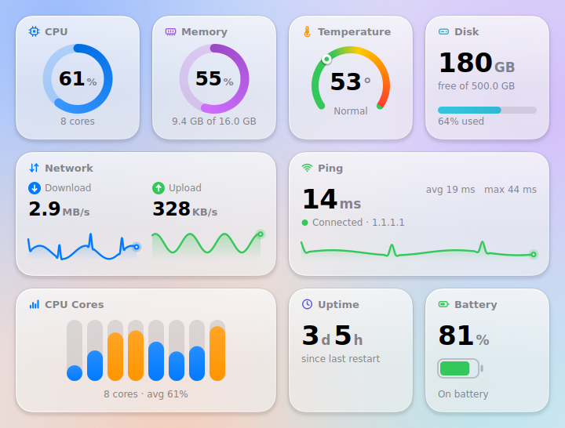
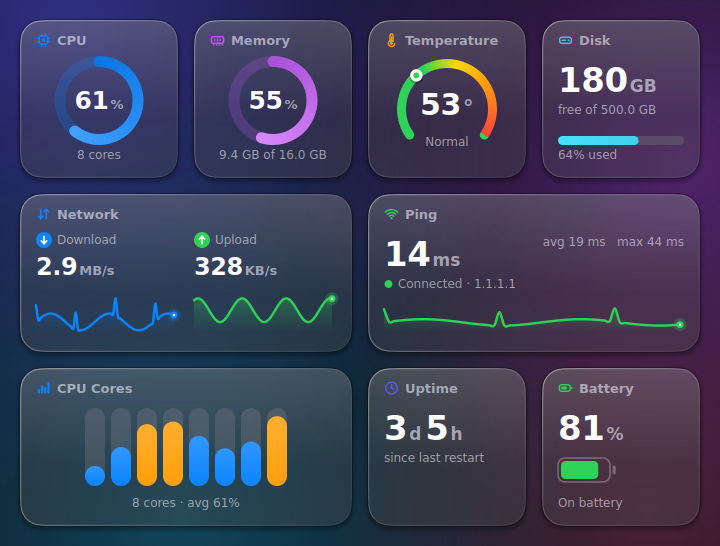
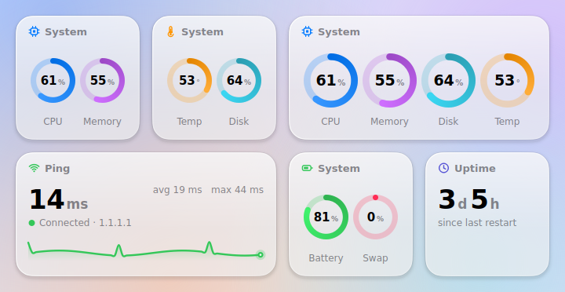
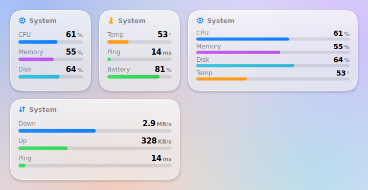
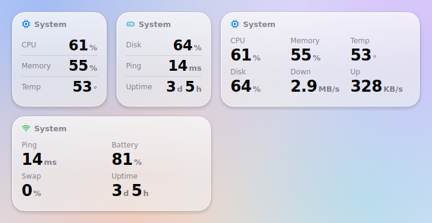
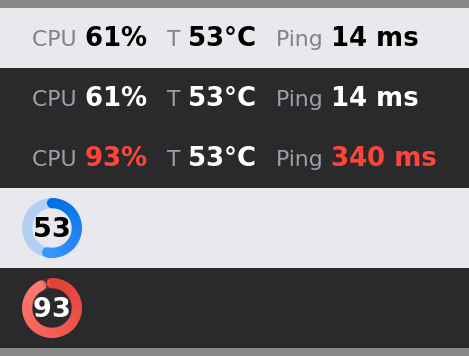

# IOX Stats

System status at a glance - **iOS-style widgets** for CPU, memory, disk, network, ping and temperature,
plus a **live readout in your menu bar / system tray**.

| Light | Dark |
|---|---|
|  |  |

### Make it yours

Every widget can be shown as **rings**, **bars**, **numbers only** or in a **detailed** view, and you choose
which values it shows. Right-click a widget (or use the menu bar menu **Widgets**):

| Style | Small | Medium |
|---|---|---|
| Detailed | 1 value | 2 values |
| Rings | 2 | 4 |
| Bars | 3 | 4 |
| Numbers only | 3 | 6 |

Values that no longer fit are greyed out. You can also add / remove / reorder widgets (up to 12) and start
from a preset (Detailed, Rings, Bars, Numbers only, Mixed). Your layout is saved in `settings.json`.

| Rings | Bars | Numbers |
|---|---|---|
|  |  |  |

Menu bar / tray readout (macOS & Linux show text, Windows shows a compact status ring):



## Features

- **Apple look & feel**: glass widget surface, continuous corners, iOS grid sizes, system fonts
  (San Francisco on macOS) and Apple's system colours - designed to sit next to native widgets
- Widgets: CPU and memory activity rings, temperature gauge, free disk space, network up/down and ping
  with smooth history charts, per-core CPU bars, uptime, battery
- Light / dark appearance (follows the system)
- **macOS widget gallery**: native widget for desktop / Notification Center (`macos-widgets/`)
- **Your choice**: rings, bars or numbers per widget, and which values each one shows
- Menu bar / tray: pick up to 4 values, colour-coded when warm, slow or full
- **Launch at Login** - opt-in, one checkbox in the menu to switch it off again
- Ping without admin rights (TCP connect), never blocks the UI
- Cross-platform (macOS, Windows, Linux) - Python 3.9+ and Qt (PySide6)

## Install & run

```bash
python3 -m venv .venv
source .venv/bin/activate            # Windows: .venv\Scripts\activate
pip install -r requirements.txt
python -m iox_stats
```

Windows / Linux: click the tray icon to show or hide the dashboard. macOS: click the menu bar item and
choose "Show Dashboard". The menu also lets you choose the menu bar values, the appearance and quit.

### One-shot setup (macOS)

```bash
bash scripts/setup_macos.sh          # venv + packages + (optional) temperature helper
source .venv/bin/activate && python -m iox_stats
```

### Launch at login

On first start IOX Stats asks once whether it should start at login (default: No). You can change it
at any time with the menu item **Launch at Login**. It uses a per-user LaunchAgent (macOS), the per-user
`Run` registry key (Windows) or an autostart entry (Linux) and starts quietly in the menu bar
(`--background`). Switching it off removes exactly that entry.

### Menu bar on macOS

The menu bar readout is a native macOS status item (needs `pyobjc-framework-Cocoa`, installed by
`requirements.txt`). If it shows a round icon instead of text, run `pip install -r requirements.txt` again.
`IOX_STATS_NO_NATIVE_STATUSITEM=1` switches back to the Qt tray icon.

### Live or snapshot? Three kinds of widgets

| Where | How live | Notes |
| --- | --- | --- |
| **IOX Stats window** and **menu bar item** | every second | the live readout |
| **Desktop Widget Mode** (menu > *Desktop Widget Mode*, or `--desktop`) | every second | frameless glass widgets behind your windows; drag them where you want them |
| **macOS widget gallery** (`macos-widgets/`) | as often as macOS allows | macOS decides when a widget refreshes - never per second |

The gallery widget shows the live values (including the CPU temperature) of the running IOX Stats app: the app writes
them to `~/Library/Application Support/IOXStats/snapshot.json` (numbers only; switch off with
`"share_with_widgets": false`), and the widget host app asks macOS to refresh the widgets every 15 seconds.

### Widgets in the macOS widget gallery

The folder [`macos-widgets/`](macos-widgets/README.md) contains a native WidgetKit widget (Swift, built with Xcode)
for the desktop and Notification Center. In *Edit Widget* you choose Rings, Bars or Numbers only and the values
(same limits as the window), including the **CPU temperature**.

```bash
brew install xcodegen && cd macos-widgets && xcodegen generate && open IOXStats.xcodeproj
```

### Glass effect

On macOS the dashboard window gets a real blur-behind (needs `pyobjc-framework-Cocoa`, installed by
`requirements.txt`). Everywhere else a simulated soft backdrop is painted. To turn the native blur off set
`"glass": false` in `settings.json` or start with `IOX_STATS_NO_NATIVE_BLUR=1`.

### CPU temperature on macOS

macOS has no public temperature API and needs **no driver** for it: a small user-space tool reads Apple's sensors.
IOX Stats finds it (also in the Homebrew folders, which an app started at login does not have on its `PATH`) and,
if it is missing, offers to install the right one with Homebrew - **no sudo, no administrator password**:

- On the first start it asks once ("Show the CPU temperature?").
- Any time later: menu bar item > **Set Up CPU Temperature...** (it shows which tool is active).
- From the terminal: `python -m iox_stats --install-helpers`, or run `bash scripts/setup_macos.sh` for everything.

By hand it is `brew install macmon` (Apple Silicon) or `brew install osx-cpu-temp` (Intel). Homebrew itself comes
from <https://brew.sh>. Remove the tool any time with `brew uninstall macmon`.

On Linux `psutil` reads the sensors directly. Without a sensor the widget shows "n/a".

## Command line

```text
python -m iox_stats --version
python -m iox_stats --once                                  # one JSON snapshot
python -m iox_stats --screenshot out.png --theme dark --demo [--layout rings|bars|numbers|mixed|detailed]
python -m iox_stats --no-tray --theme light
python -m iox_stats --background                            # menu bar only, no window (what autostart uses)
python -m iox_stats --desktop                               # start in Desktop Widget Mode
python -m iox_stats --install-helpers                       # macOS: set up the CPU temperature helper
```

Settings live in `settings.json` in your config folder (macOS: `~/Library/Application Support/IOXStats`,
Windows: `%APPDATA%\IOXStats`, Linux: `~/.config/IOXStats`).

> The screenshots are rendered headlessly with the built-in `--demo` data. On macOS the window additionally
> gets the system blur-behind, so the real thing looks even closer to native widgets.

## Development

```bash
pip install -r requirements.txt pytest
QT_QPA_PLATFORM=offscreen python -m pytest      # headless UI tests included
python scripts/check_version.py                 # version / CHANGELOG / release notes consistent?
python scripts/package_zip.py                   # dist/IOX_Stats_vX.Y.Z.zip
```

Releases follow [Semantic Versioning](https://semver.org). Every release has an entry in
[CHANGELOG.md](CHANGELOG.md) and release notes in [`docs/release-notes/`](docs/release-notes/).
See [docs/RELEASING.md](docs/RELEASING.md) for the release process and
[docs/GITHUB_SETUP.md](docs/GITHUB_SETUP.md) for connecting a (private) GitHub repository.

## Roadmap

- macOS: menu-bar-only mode (no Dock icon), acrylic / Mica glass on Windows
- Drag-and-drop arranging, settings dialog (ping host, refresh interval)
- Top processes, GPU, per-interface network, alerts / notifications
- Signed & notarized macOS build, Windows installer

## License

MIT - see [LICENSE](LICENSE).
