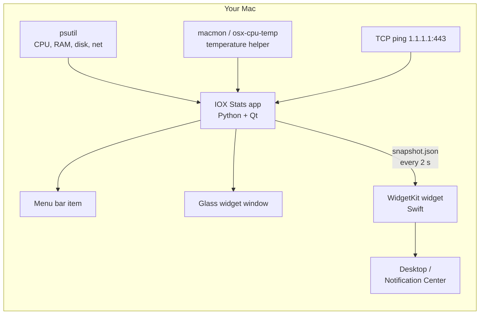

<div align="center">

# IOX Stats

**Your Mac's vital signs, dressed like iOS widgets.**

CPU · Memory · Disk · Network · Ping · CPU temperature - live in the menu bar, as glass widgets,
and right in the macOS widget gallery.


</div>

---

> **A non-commercial community project by [saxcodez](https://github.com/saxcodez).**
> IOX Stats is built for the Mac community - free to use, free to tinker with, **not for sale**.
> All rights remain with the author (see [License & intent](#license--intent)). Questions, ideas, bug reports and
> requests are very welcome: [open an issue](https://github.com/saxcodez/iox_stats/issues/new/choose).

| Light | Dark |
|---|---|
|  |  |

## Why

Activity Monitor is great for forensics, not for a glance. The menu bar tools out there are either ugly, closed or
subscription-ware. IOX Stats wants to be the thing you would expect Apple to ship: native look, honest numbers,
no account, no telemetry, no nonsense - and open for anyone to read, learn from and improve.

## Features

| | |
|---|---|
| **Menu bar readout** | Live every second. **2 values** side by side or **1 value**; pick up to 6, the rest rotate every 4 s so your other menu bar icons keep their place. Orange / red when things get hot, slow or full. |
| **Glass widgets** | Continuous corners, iOS widget grid, San Francisco, Apple system colours, light & dark. Each widget: **rings**, **bars**, **numbers** or **detailed** - and you pick the values. |
| **Widget gallery** | A native **WidgetKit** widget: right-click the desktop > *Edit Widgets* > *IOX Stats*. Fed with the app's live values, CPU temperature included. |
| **CPU temperature** | Apple Silicon and Intel. One click installs the tiny sensor helper via Homebrew - no kernel extension, no `sudo`. |
| **Well-behaved** | Launch at Login and Start Hidden are opt-in. Log file for troubleshooting. Zero data collection - the only network traffic is the ping you can see. |

## How it works



The widget runs in Apple's sandbox and cannot read sensors or run helpers itself, so the app hands it the numbers
through a small JSON file. If the app is not running, the widget measures what the sandbox allows on its own.

## Quick start

Requirements: macOS 14+, Python 3.9+ (`brew install python`), optionally [Homebrew](https://brew.sh) for the
temperature helper and Xcode (free) for the widget gallery widget.

```bash
bash scripts/setup_macos.sh
```

```bash
source .venv/bin/activate
```

```bash
python -m iox_stats
```

The setup script creates a virtual environment, installs the packages and offers to install the temperature
helper. Paste commands one at a time - zsh chokes on `# comments` pasted after a command.

### Widget gallery widget

```bash
brew install xcodegen
```

```bash
bash scripts/install_widgets.sh
```

Builds the Swift widget signed with your (free) Apple ID team, installs `IOX Stats.app` to `/Applications` and
registers the widget. Then: right-click the desktop > **Edit Widgets** > search **IOX Stats**.
Details and troubleshooting: [`macos-widgets/README.md`](macos-widgets/README.md).

## Using it

Click the menu bar item: dashboard, *Menu bar values* (pick values, **Show 2 / Show 1 value**), *Widgets*,
*Appearance*, **Launch at Login**, **Start Hidden**, **Set Up CPU Temperature...**, **About**, **Open Log Folder**.

Right-click any widget in the window to change its size, style and values:

| Style | Small | Medium |
|---|---|---|
| Detailed | 1 value | 2 values |
| Rings | 2 | 4 |
| Bars | 3 | 4 |
| Numbers only | 3 | 6 |

| Rings | Bars | Numbers |
|---|---|---|
|  |  |  |

A note on "live": the menu bar and the window update every second. Gallery widgets are refreshed when **macOS**
decides - IOX Stats asks often, macOS answers when it likes. That is a platform limit, not a bug.

### Command line

```text
python -m iox_stats --version
python -m iox_stats --once              # one JSON snapshot to stdout
python -m iox_stats --start-hidden      # menu bar only
python -m iox_stats --install-helpers   # set up the CPU temperature helper
python -m iox_stats --show-log          # where is the log?
python -m iox_stats --screenshot out.png --theme dark --demo --layout rings
```

Settings: `~/Library/Application Support/IOXStats/settings.json` · Log: `~/Library/Application Support/IOXStats/logs/`

## Project status

Pre-release (`0.x`). What is verified on real hardware and what is still open is tracked openly in
**[docs/PROJECT_STATUS.md](docs/PROJECT_STATUS.md)**. Every release: [CHANGELOG.md](CHANGELOG.md) and
[release notes](docs/release-notes/).

## Roadmap

**Towards 1.0**
- Widget gallery widget confirmed on Apple Silicon and Intel
- Downloadable **DMG**: signed app, temperature helper set up for you
- Menu-bar-only app (no Dock icon)

**After that**
- Settings window: ping target, refresh rate, your own orange / red thresholds
- Top processes, GPU load, fan speed, per-interface network
- Notifications when something stays red (e.g. CPU hot for 5 minutes)
- Large widget, StandBy-style layouts
- Localisation, German first

Got an idea that fits? [Tell us.](https://github.com/saxcodez/iox_stats/issues/new/choose)

## Contributing & requests

This project lives from feedback. The most valuable contribution right now is **a test report from your Mac**.

- **Bug?** Open a *Bug report* and attach the log (menu > *Open Log Folder*) plus macOS version and chip.
- **Idea or request?** Open a *Feature request* - requests of any kind (features, collaboration, licensing) are
  welcome there.
- **Code?** Read [CONTRIBUTING.md](CONTRIBUTING.md), fork, branch, test, pull request.

## License & intent

IOX Stats is **source-available for non-commercial use** under the
[PolyForm Noncommercial License 1.0.0](LICENSE). In plain words (the license text is what counts):

- ✅ Use it, study it, modify it, share it - for personal, hobby, educational and other non-commercial purposes.
- ❌ Selling it, bundling it into a paid product or offering it as a paid service is not allowed.
- © Copyright and all rights not granted by the license stay with **saxcodez**. For anything beyond
  non-commercial use, open an issue and ask.

This is not legal advice; it is the reason the license was chosen: a tool made with good intentions, for the
community, that nobody should be able to turn into a paywall.

IOX Stats is provided as-is, without warranty. It is not affiliated with or endorsed by Apple Inc.; macOS, Apple
Silicon and San Francisco are trademarks of Apple Inc.

<div align="center"><sub>Built with curiosity, too much coffee and a soft spot for rounded corners. - saxcodez</sub></div>
